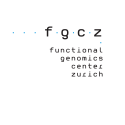

# EuBIC 2023 developers meeting

### Sunday, 15&ndash;20 January 2023, [Congressi Stefano Franscini](https://csf.ethz.ch/), [Monte Verità](https://s.geo.admin.ch/92fb27a112), Ticino, Switzerland

The EuBIC 2023 developers meeting will bring together scientists active in the field of computational proteomics.

__This repository collects proposals for [hackathon](https://en.wikipedia.org/wiki/Hackathon) projects at the EuBIC 2023 developers meeting.__ For details about the submission format, see below.

For more information about the meeting, please check the **[official website](https://eubic-ms.org/events/2023-developers-meeting/)**.

## Submission of project proposals 

Topics for the hackathon sessions during the EuBIC 2023 developers meeting can now be proposed!

Please carefully read the **[full guidelines](https://github.com/eubic/EuBIC2023/blob/master/FullGuidelines.md)** before submitting a project proposal and make sure to add all relevant information to your proposal. Examples from the EuBIC 2023 developers meeting can be found **[here](https://github.com/eubic/EuBIC2023/issues/3)**.

### How to submit a project proposal?

Create an **[issue](https://github.com/eubic/EuBIC2023/issues)** in this repository describing your project. When creating an issue a template is provided listing some of the relevant information that should be included:

**Project description:**

- A general abstract of up to 200 words describing the goal of the project and why it is well suited as a community project.
- A (high-level) project plan detailing the work to be conducted. This primarily includes tasks that will be tackled during the developers meeting, but we encourage you to also think about a follow-up strategy.

**Technical details:**

- The programming language(s) that will be used.
- (If applicable) any existing software that will be featured.
- (If applicable) any datasets that will be used and their availability.

**Contact information:**

- Your name, affiliation, and contact information.

### How to contribute?

- Vote for your favorite project in the [Discussions](https://github.com/eubic/EuBIC2023/discussions/5) section!
- Leave comments to interesting proposals. Engage in a discussion to finetune the project proposals!

### Important deadlines

- Hackathons proposal deadline: September 30th, 2022
- Notification of accepted hackathons: November 1st, 2022

### Powered by

<table>
  <tr>
    <th >

    </th>
    <th>

    </th>
</table>

### Sponsors 

